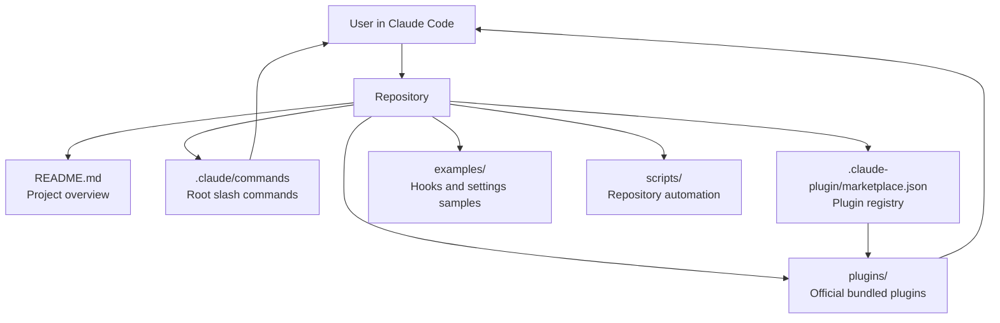
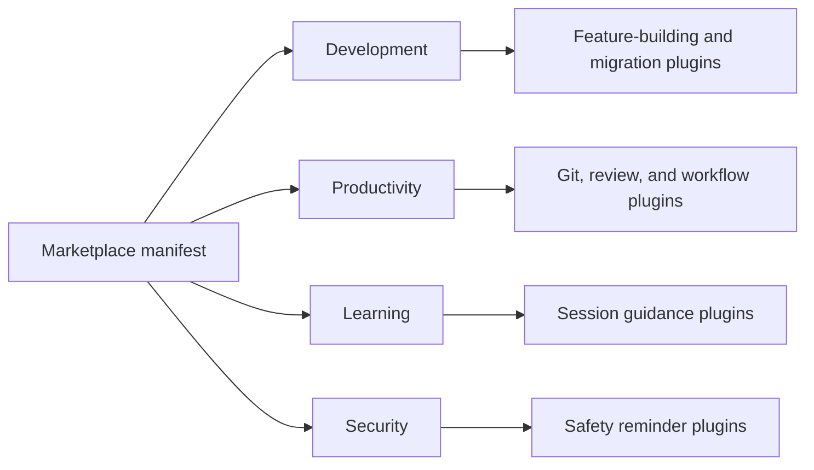
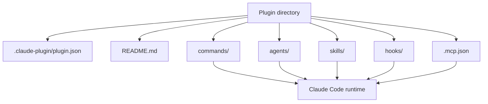
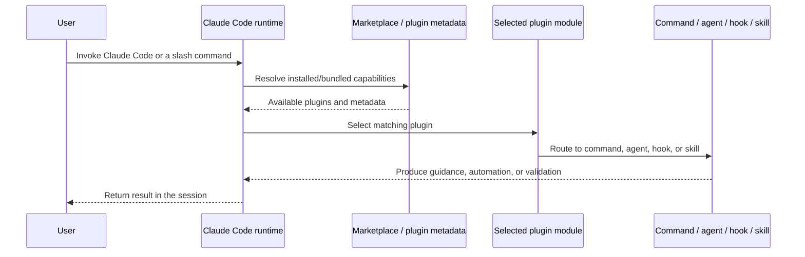

# Claude Code Repository Architecture

This repository is organized as a Claude Code plugin marketplace: it bundles a small set of root-level commands, a marketplace manifest, reusable examples, and a collection of official plugins that add commands, agents, hooks, skills, and MCP integrations.

## Module overview

- **Root documentation**: high-level project overview and usage guidance in [`README.md`](../README.md)
- **Root commands**: shared commands in [`.claude/commands/`](../.claude/commands/)
- **Marketplace metadata**: bundled plugin registry in [`.claude-plugin/marketplace.json`](../.claude-plugin/marketplace.json)
- **Plugins**: feature-focused extensions in [`plugins/`](../plugins/README.md)
- **Examples**: reference hooks and settings in [`examples/`](../examples/)
- **Scripts**: repository automation in [`scripts/`](../scripts/)

## Repository architecture



## Plugin ecosystem architecture

The bundled plugins fall into a few broad categories defined by the marketplace manifest:

- **Development**: `agent-sdk-dev`, `claude-opus-4-5-migration`, `feature-dev`, `frontend-design`, `plugin-dev`, `ralph-wiggum`
- **Productivity**: `code-review`, `commit-commands`, `hookify`, `pr-review-toolkit`
- **Learning**: `explanatory-output-style`, `learning-output-style`
- **Security**: `security-guidance`



## Standard plugin module structure

Most plugins follow the same internal layout described in [`plugins/README.md`](../plugins/README.md):

```text
plugin-name/
├── .claude-plugin/
│   └── plugin.json
├── commands/
├── agents/
├── skills/
├── hooks/
├── .mcp.json
└── README.md
```



## Runtime interaction model



## Key architectural characteristics

- The repository is **documentation- and plugin-centric**, not a traditional compiled application.
- The **marketplace manifest** is the index that describes the bundled plugin set.
- The **plugins directory** is the main extension surface; each plugin is self-contained and documented.
- **Root-level `.claude/commands`** provide repository-wide commands outside any single plugin.
- **Examples** and **scripts** support adoption and maintenance rather than runtime packaging.
