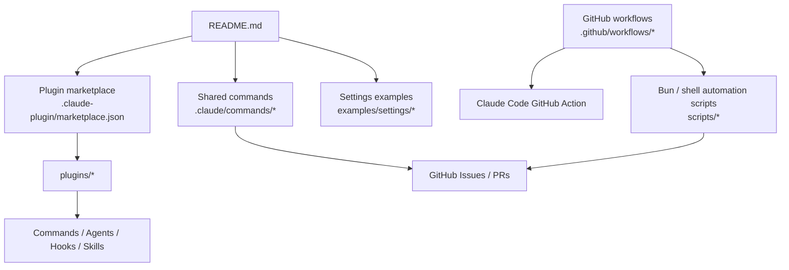
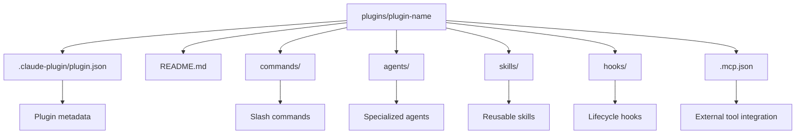
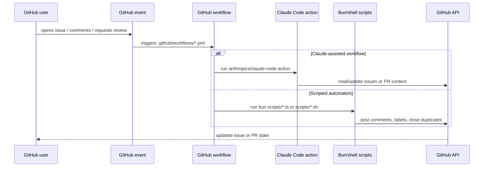

# Claude Code Repository Architecture

This repository is primarily a **plugin catalog and automation workspace** for Claude Code. It combines:

- bundled plugins under `plugins/`
- shared slash commands under `.claude/commands/`
- GitHub automation scripts under `scripts/`
- GitHub Actions workflows under `.github/workflows/`
- example settings under `examples/settings/`

## Module map

| Module | Purpose | Key files |
| --- | --- | --- |
| Root documentation | Entry points and usage guidance | `README.md`, `SECURITY.md`, `CHANGELOG.md` |
| Plugin marketplace | Registry of bundled plugins and metadata | `.claude-plugin/marketplace.json` |
| Shared commands | Reusable Claude Code slash commands for repo workflows | `.claude/commands/*.md` |
| Plugins | Feature-specific commands, agents, hooks, and skills | `plugins/*` |
| GitHub automation scripts | Bun/TypeScript scripts for issue lifecycle and duplicate handling | `scripts/*.ts`, `scripts/*.sh` |
| GitHub workflows | Event-driven automation invoking Claude Code or scripts | `.github/workflows/*.yml` |
| Settings examples | Sample org/project Claude Code settings | `examples/settings/*` |

## Repository overview

## Plugin architecture

Each bundled plugin follows the same Claude Code plugin shape.

## Automation flow

The repository's runtime behavior is driven mostly by GitHub events.

## Key architectural relationships

1. **Marketplace-first packaging**
   `.claude-plugin/marketplace.json` is the catalog entrypoint that points to the bundled plugins in `plugins/`.

2. **Plugin implementation is self-contained**
   Each plugin owns its commands, agents, skills, hooks, and documentation inside its own directory.

3. **Repository automation is workflow-driven**
   `.github/workflows/` provides the orchestration layer; the workflows either invoke Claude Code directly or run scripts from `scripts/`.

4. **Scripts act on GitHub state**
   The TypeScript and shell scripts are thin automation layers around GitHub issues, comments, labels, and pull requests.

5. **Examples document deployment patterns**
   `examples/settings/` shows how teams can configure Claude Code behavior across environments without changing plugin code.
