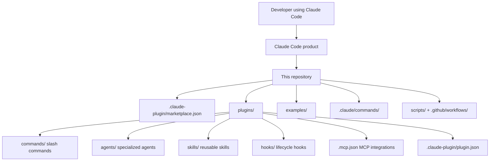

# Claude Code Repository Architecture

This repository is organized around the Claude Code plugin ecosystem. It bundles official plugins, examples, and repository automation rather than the core Claude Code application itself.

## High-level architecture



## Repository layers

### 1. Plugin marketplace and bundled plugins

- `.claude-plugin/marketplace.json` is the registry for bundled plugins in this repository.
- `plugins/` contains the plugin implementations and their README files.
- Each plugin can contribute one or more of the following building blocks:
  - **Commands** for slash-command workflows
  - **Agents** for specialized autonomous behavior
  - **Skills** for reusable expertise and guidance
  - **Hooks** for session and tool lifecycle events
  - **MCP configuration** for external tool integrations

### 2. Examples and reference material

- `examples/settings/` shows Claude Code configuration patterns.
- `examples/hooks/` provides reference hook implementations.
- These directories help users adopt the plugin and hook model in their own projects.

### 3. Repository automation

- `.claude/commands/` contains repository-specific commands used for issue and PR workflows.
- `scripts/` and `.github/workflows/` automate tasks such as issue triage, deduplication, and repository maintenance.

## Standard plugin shape

Most plugins follow this structure:

```text
plugin-name/
├── .claude-plugin/
│   └── plugin.json
├── commands/
├── agents/
├── skills/
├── hooks/
├── .mcp.json
└── README.md
```

## How the pieces fit together

1. Claude Code loads plugin metadata from the marketplace and plugin manifests.
2. Installed plugins expose commands, agents, skills, hooks, and optional MCP integrations.
3. Users invoke plugin capabilities from Claude Code sessions.
4. Example configurations show how to adapt the same patterns in downstream projects.
5. Repository automation keeps the plugin collection and issue workflows maintained over time.
