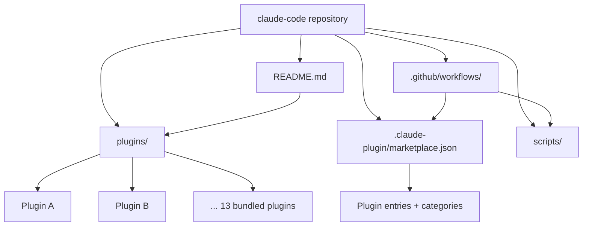
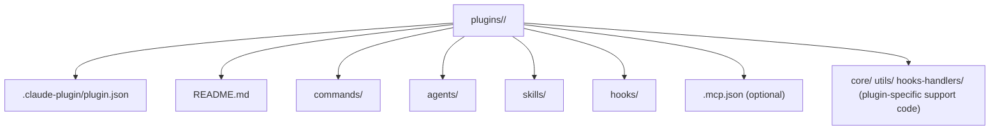
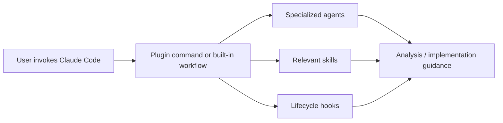
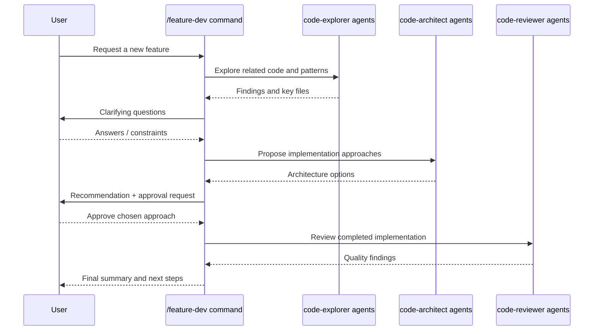

# Claude Code Repository Architecture

This repository is organized as a **plugin marketplace for Claude Code**. Most of the implementation lives in self-contained plugins, while the root of the repository provides marketplace metadata, documentation, automation scripts, and GitHub workflows.

## Primary modules

| Path | Role |
| --- | --- |
| `/README.md` | Top-level product and repository overview |
| `/.claude-plugin/marketplace.json` | Registry of bundled plugins and their categories |
| `/plugins/` | 13 bundled plugins, each with its own commands, agents, skills, hooks, and README |
| `/scripts/` | TypeScript and shell automation used by repository workflows |
| `/.github/workflows/` | CI and issue/PR automation workflows |

## Repository architecture

## Plugin anatomy

All bundled plugins follow the same high-level structure documented in `plugins/README.md`.

## Runtime interaction model

Claude Code composes plugin features from a few reusable building blocks:

- **Commands** provide user-facing workflows.
- **Agents** perform specialized analysis or implementation in parallel.
- **Skills** inject reusable knowledge or instructions.
- **Hooks** run on lifecycle events such as `SessionStart`, `PreToolUse`, `Stop`, or similar events.

## Representative plugin groups

| Group | Examples | Responsibility |
| --- | --- | --- |
| Development workflows | `feature-dev`, `plugin-dev`, `agent-sdk-dev`, `ralph-wiggum` | Guide feature delivery, plugin authoring, SDK work, and iterative task loops |
| Review and quality | `code-review`, `pr-review-toolkit`, `security-guidance` | Review pull requests, analyze risk, and warn about unsafe changes |
| Productivity | `commit-commands`, `hookify` | Automate git flows and configurable safety/productivity rules |
| Learning and UX | `frontend-design`, `explanatory-output-style`, `learning-output-style`, `claude-opus-4-5-migration` | Add design guidance, educational context, learning-oriented behavior, and migration help |

## Example workflow: command-driven feature delivery

The `feature-dev` plugin is a good example of how the parts fit together.

## Key architectural takeaways

1. The repository is **plugin-first**: functionality is grouped into independently documented plugins under `/plugins/`.
2. The marketplace file is the **catalog and discovery layer** for those plugins.
3. GitHub workflows and repository scripts provide **operational automation** around issues, triage, and maintenance.
4. The core abstraction used across plugins is a combination of **commands, agents, skills, and hooks**.
