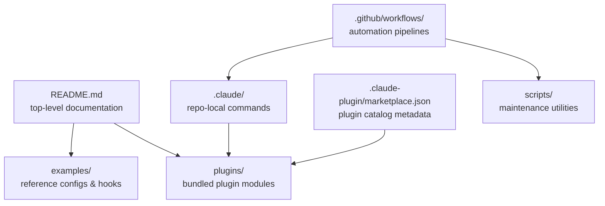
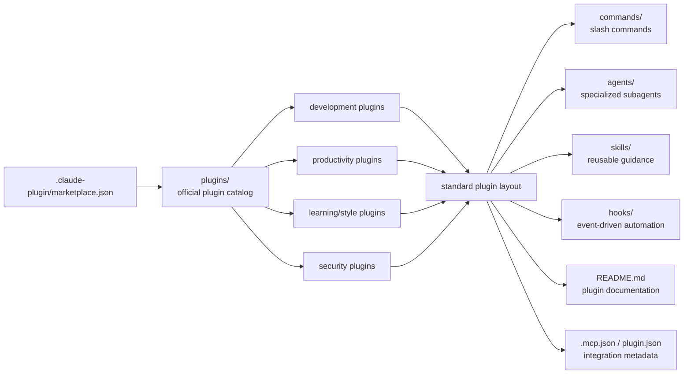
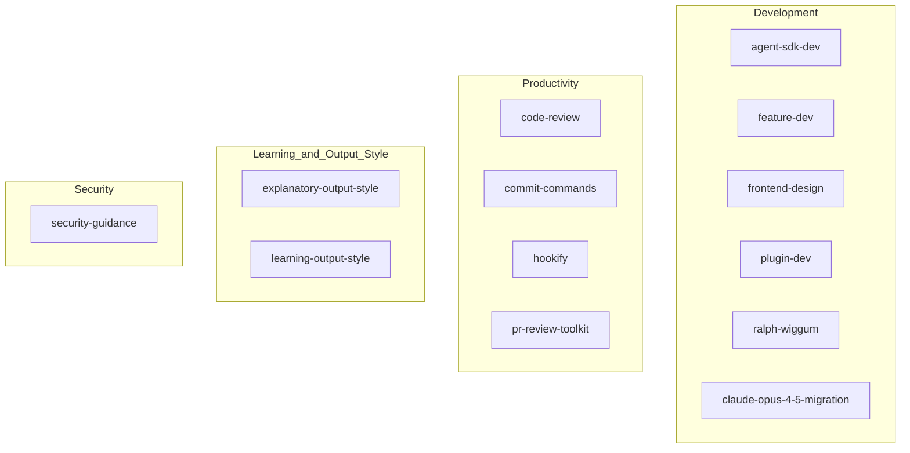
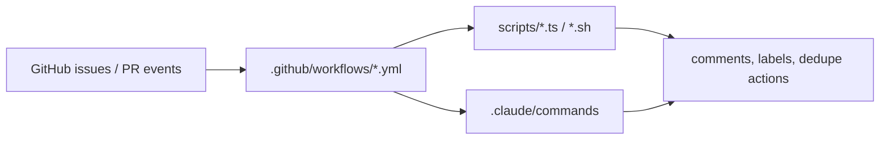

# Claude Code Repository Architecture

This repository is organized as a documentation- and plugin-centric codebase for Claude Code. The main deliverables are bundled plugins, supporting examples, and GitHub automation used to maintain the repository itself.

## Top-level modules

| Module | Purpose |
| --- | --- |
| [`README.md`](../README.md) | Entry point for product-level documentation and plugin discovery. |
| [`plugins/`](../plugins/README.md) | Bundled Claude Code plugins, each with its own commands, agents, skills, hooks, and docs. |
| [`.claude/`](../.claude/) | Repository-local Claude commands and settings used while working in this repo. |
| [`.claude-plugin/`](../.claude-plugin/marketplace.json) | Marketplace metadata describing the bundled plugin catalog. |
| [`examples/`](../examples/) | Example hook scripts and settings for plugin authors. |
| [`scripts/`](../scripts/) | Maintenance utilities used by repository automation. |
| [`.github/workflows/`](../.github/workflows/) | GitHub Actions workflows for issue triage, dedupe, sweeping, and repo maintenance. |

## Architecture overview

## Plugin system architecture

The `plugins/` directory is the functional center of the repository. Each plugin is a self-contained module that follows the same structure and can contribute different Claude Code capabilities.

## Bundled plugin categories

## Repository automation architecture

The repository is also maintained through automation. Workflows in `.github/workflows/` orchestrate scripts in `scripts/` to triage issues, deduplicate reports, and keep repository hygiene in place.

## How the modules fit together

1. The root documentation points users to bundled plugins and setup guidance.
2. Marketplace metadata enumerates the official plugins shipped in the repository.
3. Each plugin encapsulates its own commands, agents, skills, hooks, and optional MCP integration.
4. Example files show plugin authors how to configure settings and hooks.
5. GitHub Actions workflows and maintenance scripts keep issue management and repository operations running.
